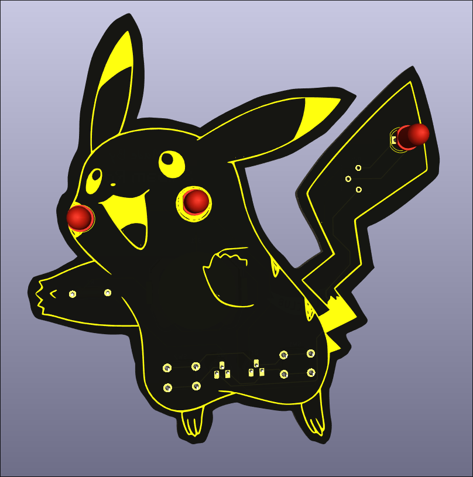
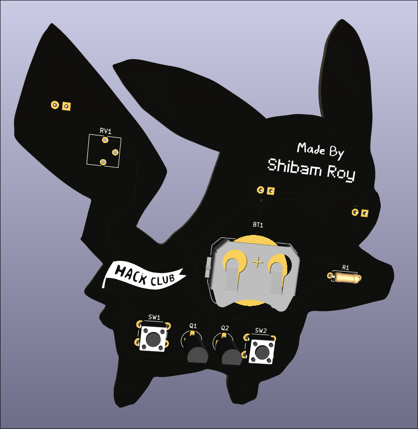
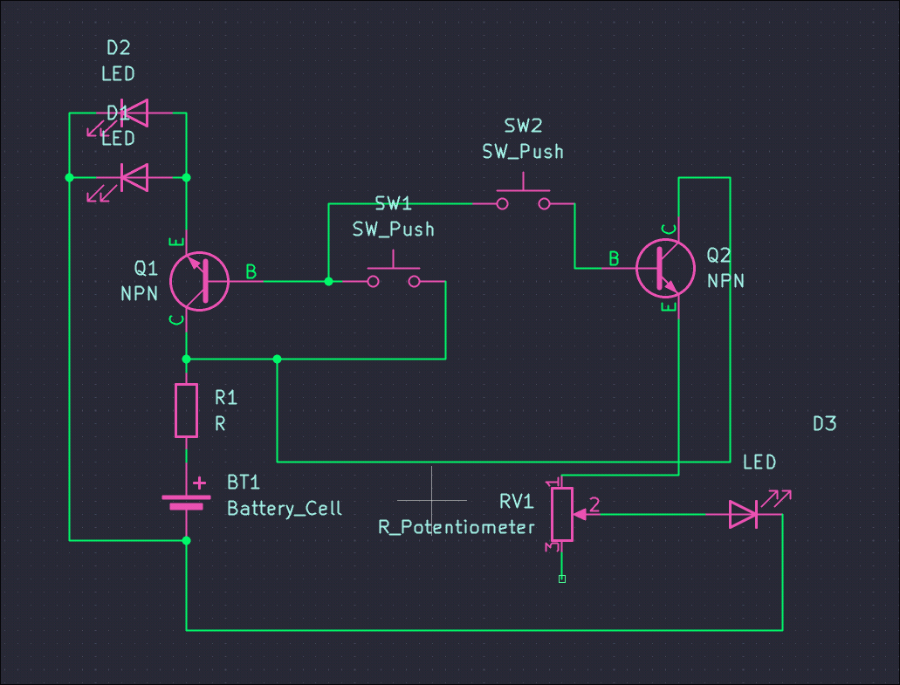
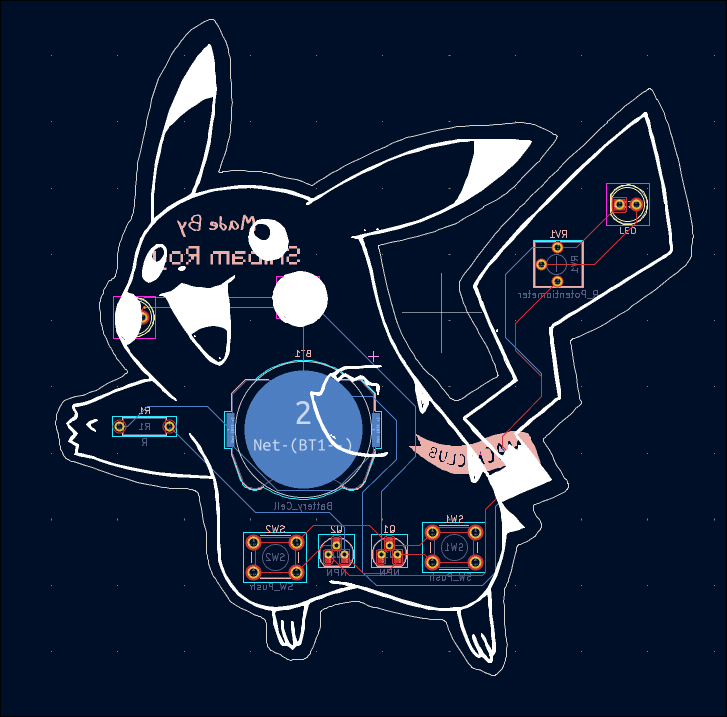

# Transisted

## Description
Its a simple project that I made to learn about transistors!
I used [Pikachu](https://en.wikipedia.org/wiki/Pikachu) for the design of the board, cause it looks kawaii to me:) (To whom does it not look cute?)
It primarily consists of 3 LEDs, when the first push button is pressed, the first 2 LEDs (cheeks of pikachu) glow up.
The second button is conditional, and only works when the first one is activated.
Moreover, the second LED (at the tail of pikachu) can have a variable brightness, as it passes through a potentiometer.

## Simulations

Some simulations if you want to try out my circuit!

*Tinkercad* - [here](https://www.tinkercad.com/things/52eL0hILRMp-transisted?sharecode=undefined)
*CircuitJS* - [here](https://tinyurl.com/265tfk4g)

## Screenshots

### 3D front

### 3D back

### Schematic

### PCB

## Credits

Thank you Hackclub for providing such great learning resources! This project was made during an event called [solder](https://solder.hackclub.com) at Hackclub, where teenagers build circuits and learn about electronics!
Special thanks to [@cyao](https://github.com/cheyao) and [@acon](https://github.com/acornitum) for organising this event and writing such a nice guide for beginners 💖
